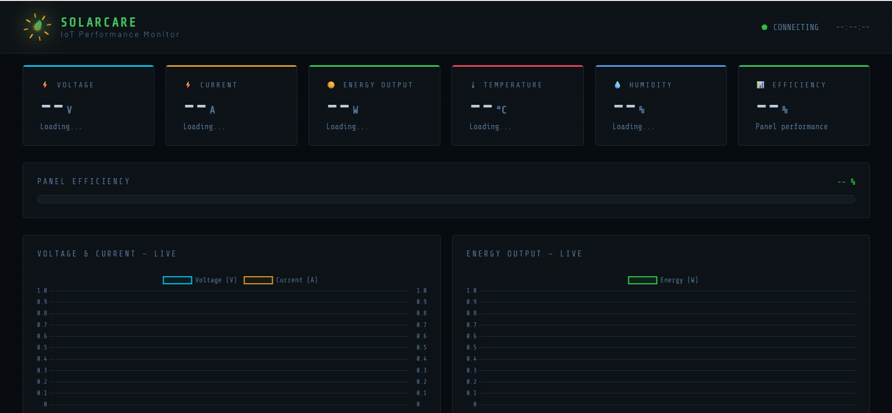

# iot-Dashboard
IoT Solar Panel Monitoring Dashboard
# IoT Solar Panel Monitoring Dashboard

This project monitors the health and performance of solar panels using IoT technology.

## Features
- Real-time voltage monitoring
- Current monitoring
- Power calculation
- Solar panel efficiency tracking
- Dashboard visualization

## Technologies Used
- HTML
- CSS
- JavaScript
- Arduino
- IoT Sensors

## How It Works
Sensors connected to the solar panel collect voltage and current data.
The data is sent to the IoT dashboard where it is displayed in real time.

## Future Improvements
- Mobile app integration
- Fault detection alerts
- Cloud data storage
## Dashboard Preview

- 
